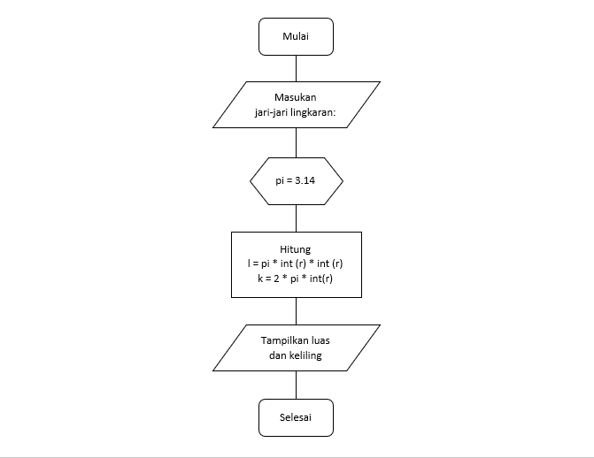

# pratikum3

# Menghitung Luas Dan Keliling Lingkaran

> Flowchart Menghitung Luas dan Keliling lingkaran

> Langkah-Langkah Membuat Program Menghitung Luas Dan Keliling Lingkaran

1.Memasukan nilai Jari-jari

2.Deklarasikan variabel

- Deklarasikan variabel pi = 3.14 otomatis menggunakan tipe data float karena bernilai desimal

3.Implementasikan rumus perhitungan luas dan keliling lingkaran

- Masukan rumus luas = pi (3,14) kalikan (*) dengan nilai jari-jari yang dimasukan int (r) * int (r) dan rumus keliling = 2 * pi * int(r)

4.Cetak hasil perhitungan

5.Run python code dan lihat hasilnya di kolom terminal

- Masukan nilai jari-jari lingkaran yang ingin dihitung, maka secara otomatis program akan mencetak hasil dengan sendirinya

6.Opsi lain

- Tambahkan "{:.*f}".format(). Simbol bintang pada .*f bisa diubah dengan angka

7.Run python code dan ini hasilnya

- Maka dari itu nomor atau karakter yang berada di belakang koma desimal akan dibatasi

 

